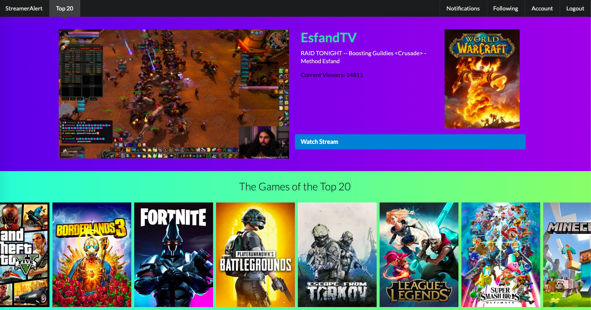

# Streamer Alert

Application to view and track your favorite streams. Built as my first `Vue.js` project using `oauth2` and `TwitchAPI`.



TODO:
- [ ] Design Followers Page fetching authenticated users followed list
- Style Pages
  - [ ] Landing Page
  - [ ] Followers Page
  - [ ] Add Profile Configuration page
- Setup VueRouter to use isActive styling on links.

## npm packages
- "lodash": "^4.17.15"
- "qs": "^6.7.0"
- "vue": "^2.6.10"
- "vue-router": "^3.1.2"
- "vuex": "^3.1.1"
- "semantic-ui"

## Project setup
```
npm install
```

### Compiles and hot-reloads for development
```
npm run serve
```

### Compiles and minifies for production
```
npm run build
```

### Run your tests
```
npm run test
```

### Lints and fixes files
```
npm run lint
```

### Customize configuration
See [Configuration Reference](https://cli.vuejs.org/config/).
